# Praktikum 1-6 Pemrograman Web 2

```bash
Dzikry Eza Yusuf (312310731) TI.23.A2

```

---

# Daftar Praktikum

*   **[Praktikum 1](#praktikum-1)**
*   **[Praktikum 2](#praktikum-2)**
*   **[Praktikum 3](#praktikum-3)**
*   **[Praktikum 4](#praktikum-4)**
*   **[Praktikum 5](#praktikum-5)**
*   **[Praktikum 6](#praktikum-6)**

---

# Praktikum 1

### Aktifkan Extensi

Buka `xampp -> apache -> config -> php.ini`

Hilangkan tanda `;` pada ekstensi yang akan diaktifkan. Kemudian simpan kembali filenya dan restart Apache web server.

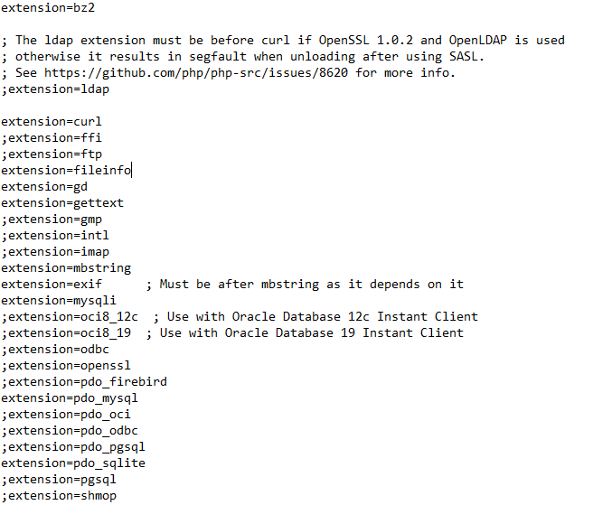

### Buka Browser

Ketik (http://localhost/lab11_ci/ci4/public) di browser. Akan muncul seperti gambar dibawah.

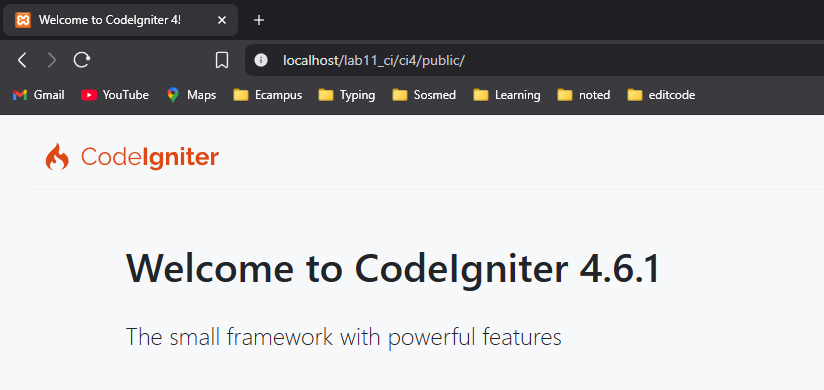

### Menjalankan CLI

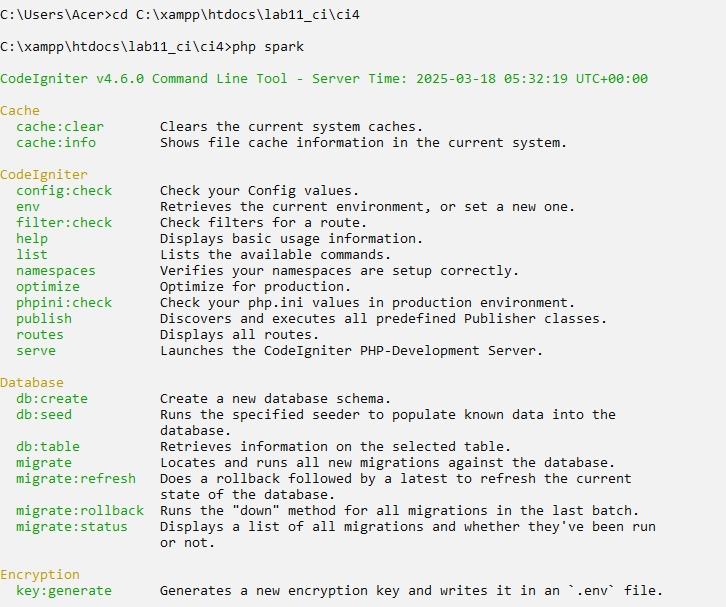

### Mengaktifkan Mode Debugging

`Ubah nama file env menjadi .env kemudian buka file tersebut dan ubah nilai variable 
CI_ENVIRINMENT menjadi development.`

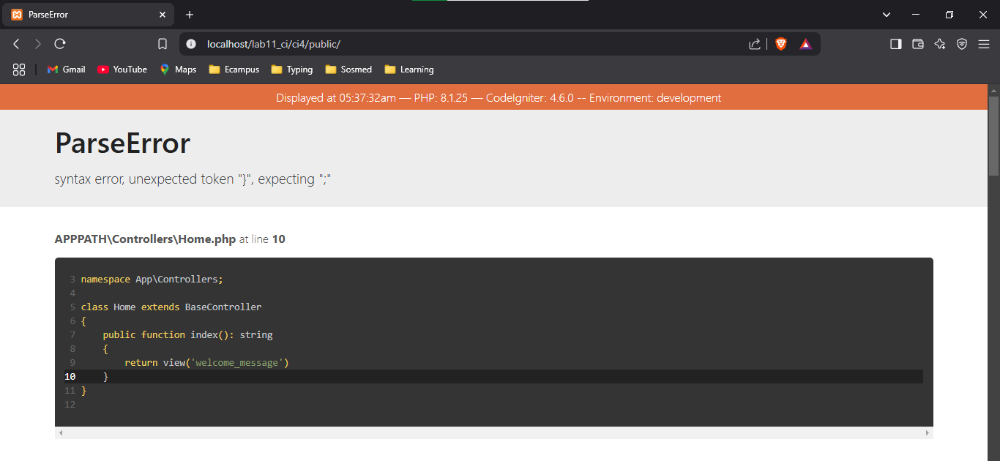

### Memahami Konsep MVC (Model-View-Controller)

`Membuat Route Baru.
Tambahkan kode berikut di dalam Routes.php
$routes->get('/about', 'Page::about');
$routes->get('/contact', 'Page::contact');
$routes->get('/faqs', 'Page::faqs')`

**Lalu Ketik php spark routes**

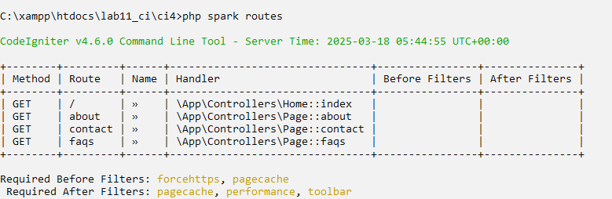

### Membuat Controller

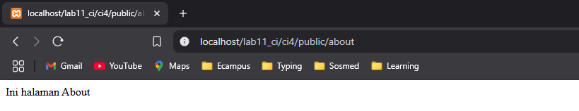

### Auto Routing

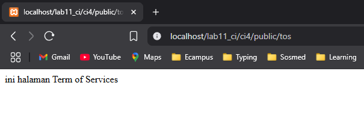

### Membuat View

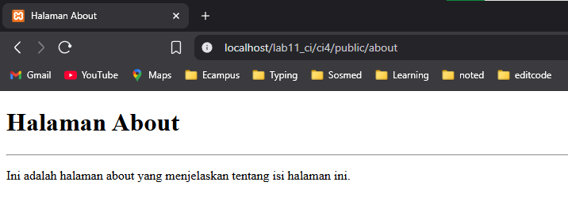

### Membuat Layout Web dengan CSS

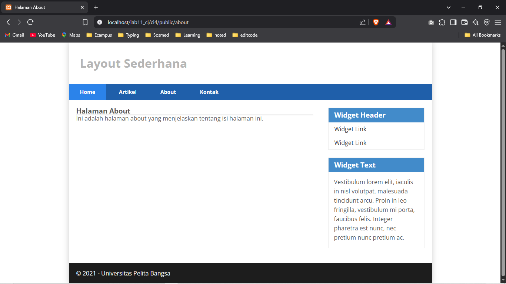


# Praktikum 2

### Membuat Artikel dengan mengakses url (http://localhost:8080/artikel)

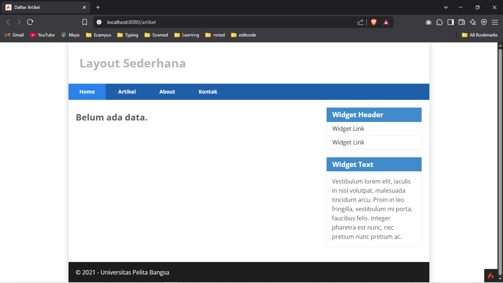

### Menambahkan beberapa data pada database agar dapat di tampilkan datanya

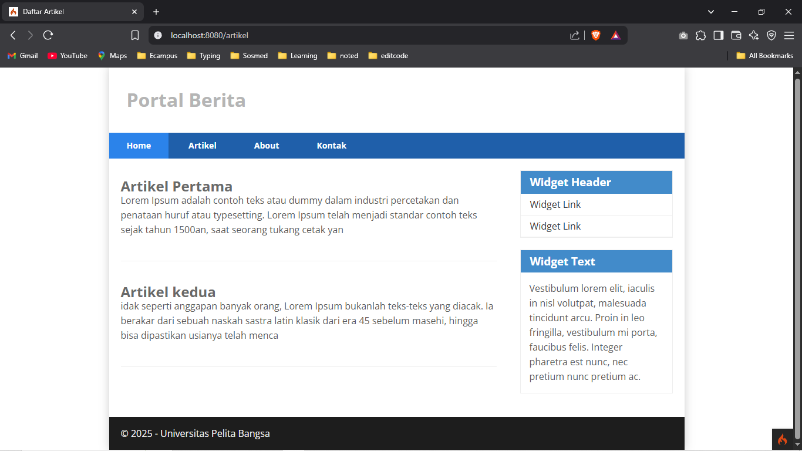

### Membuat menu admin dengan mengakses menu admin dengan url (http://localhost:8080/admin/artikel)

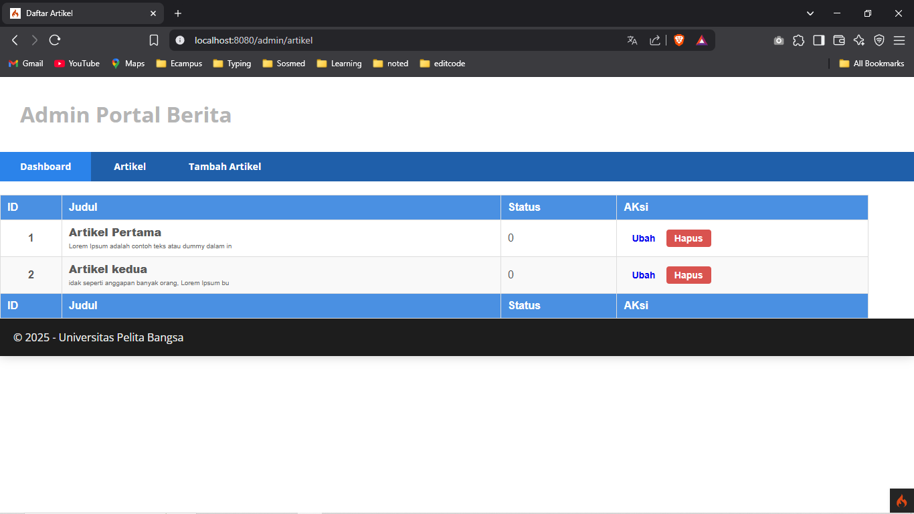

### Membuat data artikel dengan menambahkan fungsi pada Controller Artikel dengan nama add(), lalu membuat view untuk form dengan nama form_add.php

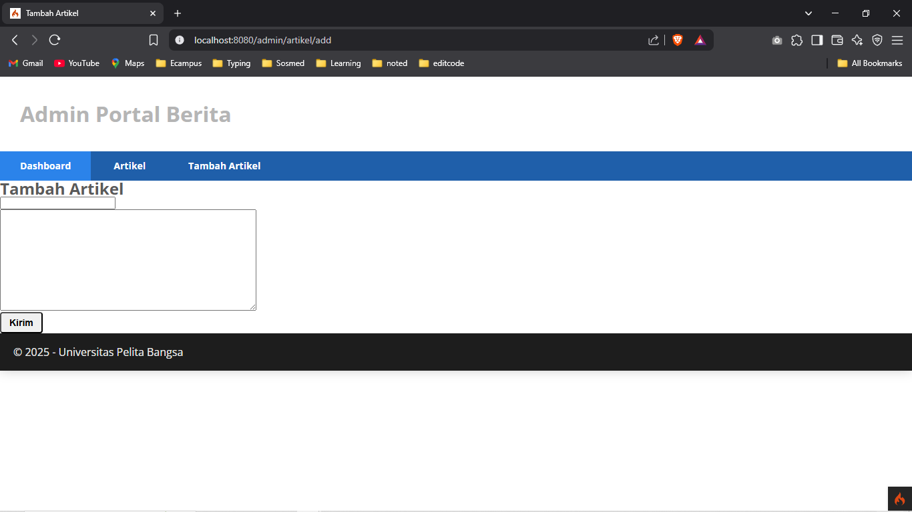

### Mengubah data dengan menambahkan fungsi baru pada Controller Artikel dengan nama edit().

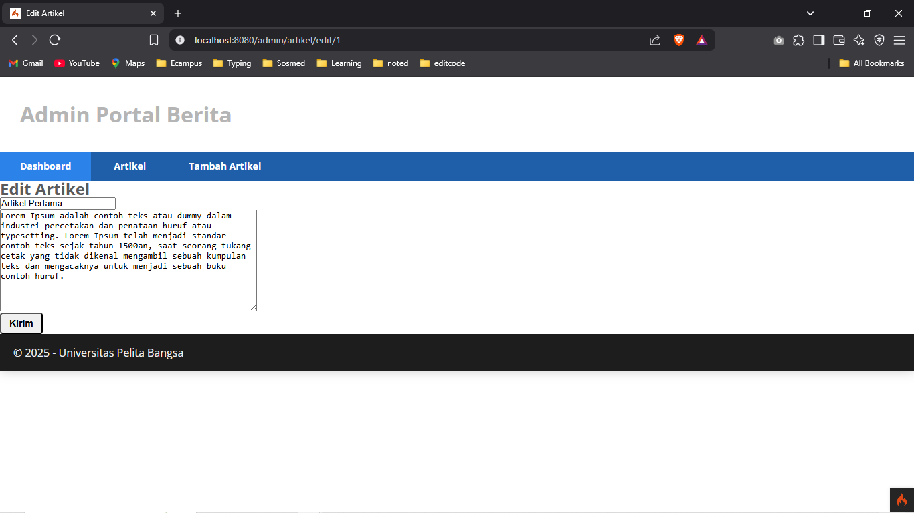

### Menghapus Data dengan menambahkan fungsi baru pada Controller Artikel dengan nama delete().


---

# Praktikum 3

### Membuat Layout Utama
`Buat folder layout di dalam app/views/`
`Buat file main.php di dalam folder layout dengan kode berikut: `

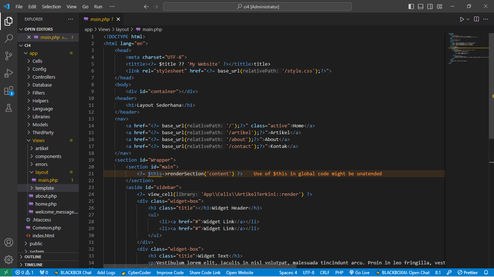
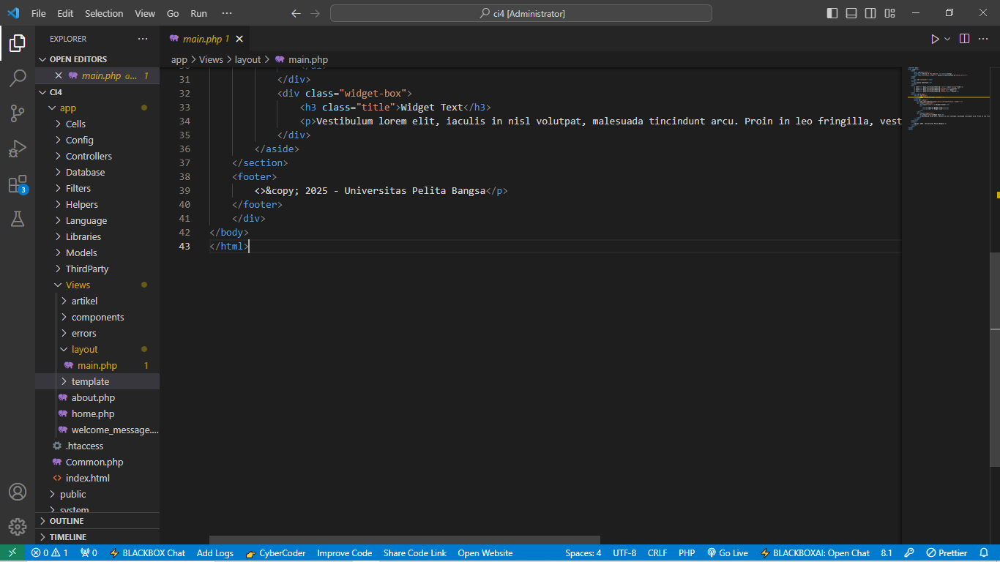

### Modifikasi File View
`Ubah app/Views/home.php agar sesuai dengan layout baru: `

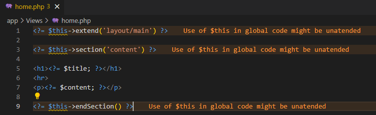

### Membuat Class View Cell 
`Buat folder Cells di dalam app/`
`Buat file ArtikelTerkini.php di dalam app/Cells/ dengan kode berikut: `

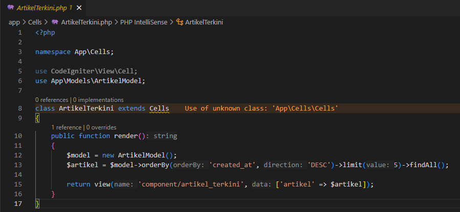

### Membuat View untuk View Cell
`Buat folder components di dalam app/Views/ `
`Buat file artikel_terkini.php di dalam app/Views/components/ dengan kode berikut: `

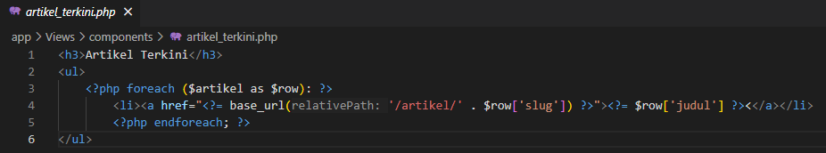

---

# Praktikum 4

### Membuat tabel user
`CREATE TABLE user (
 id INT(11) auto_increment,
 username VARCHAR(200) NOT NULL,
 useremail VARCHAR(200),
 userpassword VARCHAR(200),
 PRIMARY KEY(id)
);`

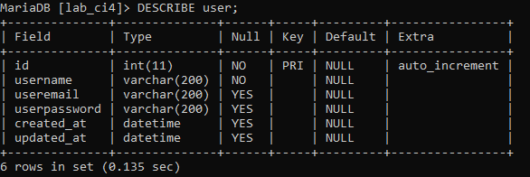

### Membuat Database Seeder

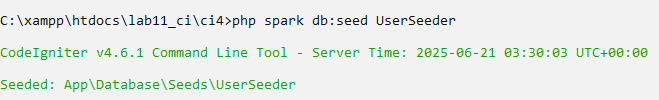

### Uji Coba Login

Selanjutnya buka URL `http://localhost:8080/user/login` 

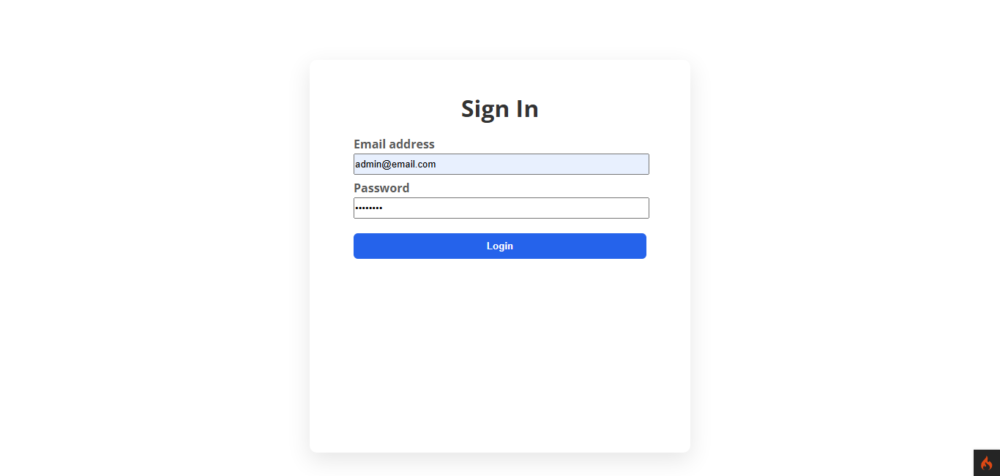

### Percobaan Akses Menu Admin

Buka url dengan alamat `http://localhost:8080/admin/artikel` ketika alamat tersebut diakses maka, akan dimuculkan halaman login.

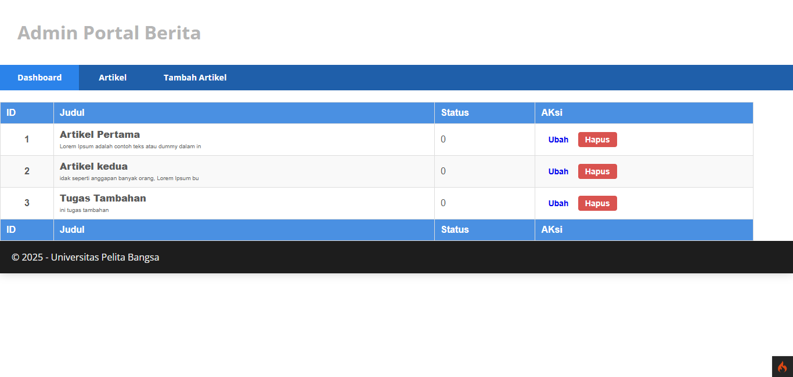

---

# Praktikum 5

### Membuat Pagination

Untuk membuat pagination, buka Kembali `Controller Artikel`, kemudian modifikasi kode pada method `admin_index` seperti berikut:

`public function admin_index() 
 {
   $title = 'Daftar Artikel';
   $model = new ArtikelModel();
   $data = [
     'title' => $title,
     'artikel' => $model->paginate(10), #data dibatasi 10 record per halaman
     'pager' => $model->pager,
   ];
   return view('artikel/admin_index', $data);
 }`

Kemudian buka file `views/artikel/admin_index.php` dan tambahkan kode berikut 
dibawah deklarasi tabel data.

`<?= $pager->links(); ?>`

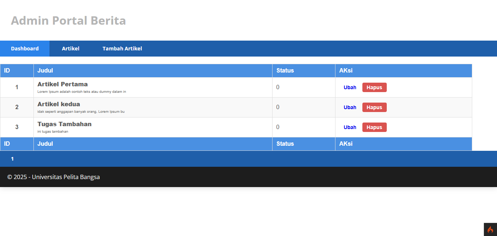

### Membuat Pencarian

Untuk membuat pencarian data, buka kembali `Controller Artikel`, pada method 
`admin_index` ubah kodenya seperti berikut:

`public function admin_index() 
 {
    $title = 'Daftar Artikel';
    $q = $this->request->getVar('q') ?? '';
    $model = new ArtikelModel();
    $data = [
        'title' => $title,
         'q' => $q,
         'artikel' => $model->like('judul', $q)->paginate(10), # data dibatasi 10 record per halaman
         'pager' => $model->pager,
    ];
    return view('artikel/admin_index', $data);
 }`

Kemudian buka kembali file `views/artikel/admin_index.php` dan tambahkan form 
pencarian sebelum deklarasi tabel seperti berikut:

 `<form action="<?= base_url('artikel/cari') ?>" method="get" style="display: flex; align-items: center;">`
    `<input type="text" name="keyword" placeholder="Cari data" 
           style="padding: 10px; margin-top: 20px; margin-left: 10px; font-size: 16px; width: 250px; border: 1px solid #ccc; border-radius: 4px;">`
    `<button type="submit" 
            style="background-color: #007bff; color: white; border: none; padding: 10px 20px; margin-left: 5px;
                   font-size: 17px; border-radius: 4px; cursor: pointer;"> Cari`
    `</button>`
`</form>`

Dan pada link pager ubah seperti berikut:
`<?= $pager->only(['q'])->links(); ?>`

Selanjutnya ujicoba dengan membuka kembali halaman admin artikel, masukkan kata 
kunci tertentu pada form pencarian.

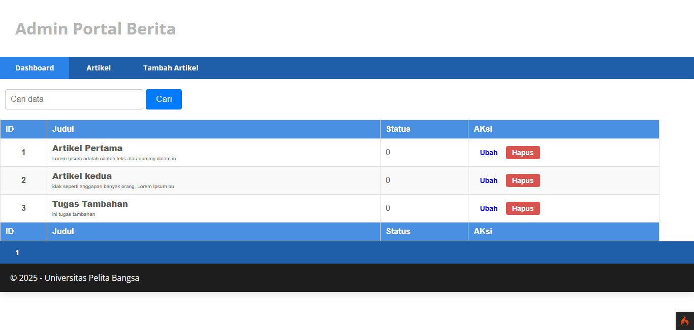

---
